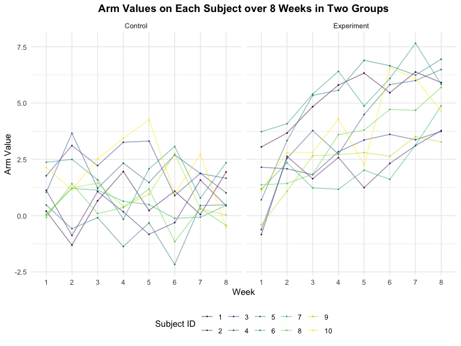
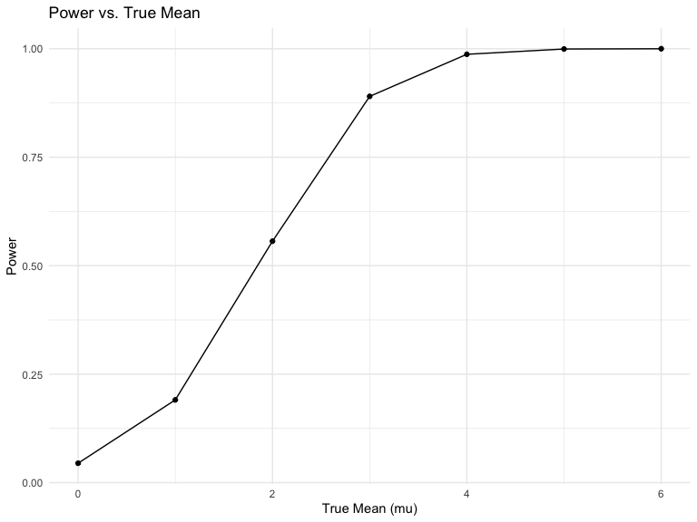
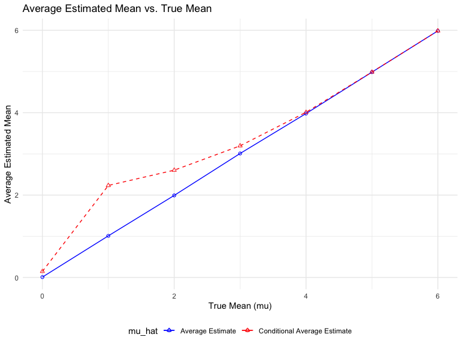

p8105_hw5_yl5219
================
Yuqing Liu
2023-11-13

``` r
library(readr)
library(tidyverse)
library(dplyr)
```

### Problem 1

``` r
homicide_data = read.csv("./homicide-data.csv")
```

The dataset has 12 variables and 52179 observations. It contains
variables including `uid`, `reported_date`, `victim_last`,
`victim_first`, `victim_race`, `victim_age`, `victim_sex`, `city`,
`state`, `lat`, `lon`, `disposition`.

``` r
homicide_data = read.csv("./homicide-data.csv")|>
  mutate(city_state = paste(city, state, sep = ","),
    resolution = case_when(
      disposition == "Closed without arrest" ~ "unsolved",
      disposition == "Open/No arrest"        ~ "unsolved",
      disposition == "Closed by arrest"      ~ "solved"
    ))|>
  filter(city_state != "Tulsa, AL") |>
  group_by(city_state, resolution)|>
  summarise(n_obs = n())

knitr::kable(homicide_data)
```

| city_state        | resolution | n_obs |
|:------------------|:-----------|------:|
| Albuquerque,NM    | solved     |   232 |
| Albuquerque,NM    | unsolved   |   146 |
| Atlanta,GA        | solved     |   600 |
| Atlanta,GA        | unsolved   |   373 |
| Baltimore,MD      | solved     |  1002 |
| Baltimore,MD      | unsolved   |  1825 |
| Baton Rouge,LA    | solved     |   228 |
| Baton Rouge,LA    | unsolved   |   196 |
| Birmingham,AL     | solved     |   453 |
| Birmingham,AL     | unsolved   |   347 |
| Boston,MA         | solved     |   304 |
| Boston,MA         | unsolved   |   310 |
| Buffalo,NY        | solved     |   202 |
| Buffalo,NY        | unsolved   |   319 |
| Charlotte,NC      | solved     |   481 |
| Charlotte,NC      | unsolved   |   206 |
| Chicago,IL        | solved     |  1462 |
| Chicago,IL        | unsolved   |  4073 |
| Cincinnati,OH     | solved     |   385 |
| Cincinnati,OH     | unsolved   |   309 |
| Columbus,OH       | solved     |   509 |
| Columbus,OH       | unsolved   |   575 |
| Dallas,TX         | solved     |   813 |
| Dallas,TX         | unsolved   |   754 |
| Denver,CO         | solved     |   143 |
| Denver,CO         | unsolved   |   169 |
| Detroit,MI        | solved     |  1037 |
| Detroit,MI        | unsolved   |  1482 |
| Durham,NC         | solved     |   175 |
| Durham,NC         | unsolved   |   101 |
| Fort Worth,TX     | solved     |   294 |
| Fort Worth,TX     | unsolved   |   255 |
| Fresno,CA         | solved     |   318 |
| Fresno,CA         | unsolved   |   169 |
| Houston,TX        | solved     |  1449 |
| Houston,TX        | unsolved   |  1493 |
| Indianapolis,IN   | solved     |   728 |
| Indianapolis,IN   | unsolved   |   594 |
| Jacksonville,FL   | solved     |   571 |
| Jacksonville,FL   | unsolved   |   597 |
| Kansas City,MO    | solved     |   704 |
| Kansas City,MO    | unsolved   |   486 |
| Las Vegas,NV      | solved     |   809 |
| Las Vegas,NV      | unsolved   |   572 |
| Long Beach,CA     | solved     |   222 |
| Long Beach,CA     | unsolved   |   156 |
| Los Angeles,CA    | solved     |  1151 |
| Los Angeles,CA    | unsolved   |  1106 |
| Louisville,KY     | solved     |   315 |
| Louisville,KY     | unsolved   |   261 |
| Memphis,TN        | solved     |  1031 |
| Memphis,TN        | unsolved   |   483 |
| Miami,FL          | solved     |   294 |
| Miami,FL          | unsolved   |   450 |
| Milwaukee,wI      | solved     |   712 |
| Milwaukee,wI      | unsolved   |   403 |
| Minneapolis,MN    | solved     |   179 |
| Minneapolis,MN    | unsolved   |   187 |
| Nashville,TN      | solved     |   489 |
| Nashville,TN      | unsolved   |   278 |
| New Orleans,LA    | solved     |   504 |
| New Orleans,LA    | unsolved   |   930 |
| New York,NY       | solved     |   384 |
| New York,NY       | unsolved   |   243 |
| Oakland,CA        | solved     |   439 |
| Oakland,CA        | unsolved   |   508 |
| Oklahoma City,OK  | solved     |   346 |
| Oklahoma City,OK  | unsolved   |   326 |
| Omaha,NE          | solved     |   240 |
| Omaha,NE          | unsolved   |   169 |
| Philadelphia,PA   | solved     |  1677 |
| Philadelphia,PA   | unsolved   |  1360 |
| Phoenix,AZ        | solved     |   410 |
| Phoenix,AZ        | unsolved   |   504 |
| Pittsburgh,PA     | solved     |   294 |
| Pittsburgh,PA     | unsolved   |   337 |
| Richmond,VA       | solved     |   316 |
| Richmond,VA       | unsolved   |   113 |
| Sacramento,CA     | solved     |   237 |
| Sacramento,CA     | unsolved   |   139 |
| San Antonio,TX    | solved     |   476 |
| San Antonio,TX    | unsolved   |   357 |
| San Bernardino,CA | solved     |   105 |
| San Bernardino,CA | unsolved   |   170 |
| San Diego,CA      | solved     |   286 |
| San Diego,CA      | unsolved   |   175 |
| San Francisco,CA  | solved     |   327 |
| San Francisco,CA  | unsolved   |   336 |
| Savannah,GA       | solved     |   131 |
| Savannah,GA       | unsolved   |   115 |
| St. Louis,MO      | solved     |   772 |
| St. Louis,MO      | unsolved   |   905 |
| Stockton,CA       | solved     |   178 |
| Stockton,CA       | unsolved   |   266 |
| Tampa,FL          | solved     |   113 |
| Tampa,FL          | unsolved   |    95 |
| Tulsa,AL          | solved     |     1 |
| Tulsa,OK          | solved     |   390 |
| Tulsa,OK          | unsolved   |   193 |
| Washington,DC     | solved     |   756 |
| Washington,DC     | unsolved   |   589 |

``` r
homicide_df =  
  read_csv("./homicide-data.csv", na = c("", "NA", "Unknown")) %>%
  mutate(
    city_state = str_c(city, state, sep = ", "),
    resolution = case_when(
      disposition == "Closed without arrest" ~ "unsolved",
      disposition == "Open/No arrest"        ~ "unsolved",
      disposition == "Closed by arrest"      ~ "solved"
    )
  ) %>% 
  filter(city_state != "Tulsa, AL") 
```

    ## Rows: 52179 Columns: 12
    ## ── Column specification ────────────────────────────────────────────────────────
    ## Delimiter: ","
    ## chr (8): uid, victim_last, victim_first, victim_race, victim_sex, city, stat...
    ## dbl (4): reported_date, victim_age, lat, lon
    ## 
    ## ℹ Use `spec()` to retrieve the full column specification for this data.
    ## ℹ Specify the column types or set `show_col_types = FALSE` to quiet this message.

The resulting dataframe has 52178 entries, on variables that include the
victim name, race, age, and sex; the date the homicide was reported; and
the location of the homicide. In cleaning, I created a `city_state`
variable that includes both city and state, and a `resolution` variable
to indicate whether the case was closed by arrest. I also excluded one
entry in Tulsa, AL, which is not a major US city and is most likely a
data entry error.

In the next code chunk, I group within cities and summarize to produce
the total number of homicides and the number that are solved.

``` r
city_homicide_df = 
  homicide_df %>% 
  select(city_state, disposition, resolution) %>% 
  group_by(city_state) %>% 
  summarize(
    hom_total = n(),
    hom_unsolved = sum(resolution == "unsolved"))
```

Focusing only on Baltimore, MD, I can use the `prop.test` and
`broom::tidy` functions to obtain an estimate and CI of the proportion
of unsolved homicides in that city. The table below shows those values.

``` r
bmore_test = 
  prop.test(
    x = filter(city_homicide_df, city_state == "Baltimore, MD") %>% pull(hom_unsolved),
    n = filter(city_homicide_df, city_state == "Baltimore, MD") %>% pull(hom_total)) 

broom::tidy(bmore_test) %>% 
  knitr::kable(digits = 3)
```

| estimate | statistic | p.value | parameter | conf.low | conf.high | method                                               | alternative |
|---------:|----------:|--------:|----------:|---------:|----------:|:-----------------------------------------------------|:------------|
|    0.646 |   239.011 |       0 |         1 |    0.628 |     0.663 | 1-sample proportions test with continuity correction | two.sided   |

Building on this code, I can use functions in the `purrr` package to
obtain estimates and CIs for the proportion of unsolved homicides in
each city in my dataset. The code below implements this analysis.

``` r
test_results = 
  city_homicide_df %>% 
  mutate(
    prop_tests = map2(hom_unsolved, hom_total, \(x, y) prop.test(x = x, n = y)),
    tidy_tests = map(prop_tests, broom::tidy)) %>% 
  select(-prop_tests) %>% 
  unnest(tidy_tests) %>% 
  select(city_state, estimate, conf.low, conf.high) %>% 
  mutate(city_state = fct_reorder(city_state, estimate))
```

Finally, I make a plot showing the estimate (and CI) of the proportion
of unsolved homicides in each city.

``` r
test_results %>% 
  mutate(city_state = fct_reorder(city_state, estimate)) %>% 
  ggplot(aes(x = city_state, y = estimate)) + 
  geom_point() + 
  geom_errorbar(aes(ymin = conf.low, ymax = conf.high)) + 
  theme(axis.text.x = element_text(angle = 90, hjust = 1))
```


This figure suggests a very wide range in the rate at which homicides
are solved – Chicago is noticeably high and, given the narrowness of the
CI, likely is the location of many homicides.

### Problem 2

Import a dataframe containing all file names

``` r
data = tibble(list.files("./data")) |>
  mutate(file_list = paste(list.files("./data")))
```

Write a function to read multiple datasets:

- Defined function named `read_files`.Takes a parameter x representing a
  file name. Reads a CSV file using `read_csv` from the `readr` package.
  Adds a new column named “file_names” to the data frame, storing the
  file name.

- Applies the `read_files` function to each element in the “file_list”
  column of the `data` data frame using `map_df`. Combines the results
  into a single data frame named `arm_dataset`.

``` r
read_files = function(x) {
  
    data = read_csv(paste0("./data/", x))|>
      mutate(file_names = x)
}

arm_dataset = map_df(data$file_list, read_files)

arm_dataset
```

    ## # A tibble: 20 × 9
    ##    week_1 week_2 week_3 week_4 week_5 week_6 week_7 week_8 file_names
    ##     <dbl>  <dbl>  <dbl>  <dbl>  <dbl>  <dbl>  <dbl>  <dbl> <chr>     
    ##  1   0.2   -1.31   0.66   1.96   0.23   1.09   0.05   1.94 con_01.csv
    ##  2   1.13  -0.88   1.07   0.17  -0.83  -0.31   1.58   0.44 con_02.csv
    ##  3   1.77   3.11   2.22   3.26   3.31   0.89   1.88   1.01 con_03.csv
    ##  4   1.04   3.66   1.22   2.33   1.47   2.7    1.87   1.66 con_04.csv
    ##  5   0.47  -0.58  -0.09  -1.37  -0.32  -2.17   0.45   0.48 con_05.csv
    ##  6   2.37   2.5    1.59  -0.16   2.08   3.07   0.78   2.35 con_06.csv
    ##  7   0.03   1.21   1.13   0.64   0.49  -0.12  -0.07   0.46 con_07.csv
    ##  8  -0.08   1.42   0.09   0.36   1.18  -1.16   0.33  -0.44 con_08.csv
    ##  9   0.08   1.24   1.44   0.41   0.95   2.75   0.3    0.03 con_09.csv
    ## 10   2.14   1.15   2.52   3.44   4.26   0.97   2.73  -0.53 con_10.csv
    ## 11   3.05   3.67   4.84   5.8    6.33   5.46   6.38   5.91 exp_01.csv
    ## 12  -0.84   2.63   1.64   2.58   1.24   2.32   3.11   3.78 exp_02.csv
    ## 13   2.15   2.08   1.82   2.84   3.36   3.61   3.37   3.74 exp_03.csv
    ## 14  -0.62   2.54   3.78   2.73   4.49   5.82   6      6.49 exp_04.csv
    ## 15   0.7    3.33   5.34   5.57   6.9    6.66   6.24   6.95 exp_05.csv
    ## 16   3.73   4.08   5.4    6.41   4.87   6.09   7.66   5.83 exp_06.csv
    ## 17   1.18   2.35   1.23   1.17   2.02   1.61   3.13   4.88 exp_07.csv
    ## 18   1.37   1.43   1.84   3.6    3.8    4.72   4.68   5.7  exp_08.csv
    ## 19  -0.4    1.08   2.66   2.7    2.8    2.64   3.51   3.27 exp_09.csv
    ## 20   1.09   2.8    2.8    4.3    2.25   6.57   6.09   4.64 exp_10.csv

Tidy the dataset: \* Applies the `clean_names` function from the
`janitor` package to standardize column names. \* Uses `gather` to
reshape data from wide to long format, creating columns “week” and
“arm_value.” \* Utilizes `mutate` to remove “week\_” prefix from the
“week” column. \* Extracts subject IDs from file names and converts them
to integers. \* Categorizes file names as “Control” or “Experiment”
based on pattern matching. \* Converts specified columns to factors
using `mutate(across(..., as.factor))`. \* Reorders columns for better
readability.

``` r
clean_arm_dataset =
  arm_dataset |>
  janitor::clean_names() |>
  gather(key = week, value = arm_value, week_1:week_8) |>
  mutate(week = str_remove(week, "week_")) |>
  mutate(subject_ID = as.integer(str_extract(file_names, "[0-9][0-9]"))) |>
  mutate(file_names = ifelse(str_detect(file_names, "con") == TRUE,
                             "Control", "Experiment")) |>
  mutate(across(.cols = c(file_names, week, subject_ID), as.factor)) |>
  relocate(file_names, subject_ID, arm_value)

clean_arm_dataset
```

    ## # A tibble: 160 × 4
    ##    file_names subject_ID arm_value week 
    ##    <fct>      <fct>          <dbl> <fct>
    ##  1 Control    1               0.2  1    
    ##  2 Control    2               1.13 1    
    ##  3 Control    3               1.77 1    
    ##  4 Control    4               1.04 1    
    ##  5 Control    5               0.47 1    
    ##  6 Control    6               2.37 1    
    ##  7 Control    7               0.03 1    
    ##  8 Control    8              -0.08 1    
    ##  9 Control    9               0.08 1    
    ## 10 Control    10              2.14 1    
    ## # ℹ 150 more rows

draw spaghetti plot showing observations on each subject over time:

- Creates a scatter plot (`geom_point`) with a line plot (`geom_line`)
  overlay for each subject over 8 weeks.
- Colors points based on subject ID and adds transparency to lines.
- Facets the plot by file names (“Control” and “Experiment”).

``` r
clean_arm_dataset |>
  ggplot(aes(week, arm_value, color=subject_ID)) + 
  geom_point(size = 0.2) + 
  geom_line(aes(group = subject_ID), alpha=0.5) +
  facet_grid(~file_names) +
  labs(x = "Week", y = "Arm Value", 
       title = "Arm Values on Each Subject over 8 Weeks in Two Groups",
       col = "Subject ID") +
  theme(plot.title = element_text(hjust = 0.5, face = "bold"))
```



*Comment:* In the experimental group, participants generally exhibited a
rise in arm measurements over the 8-week period, with variations in the
timing and magnitude of these changes observed among individuals.
Conversely, in the control group, arm measurements fluctuated over time
without exhibiting a discernible pattern or significant shifts, in
contrast to the trends observed in the experimental group. Noteworthy is
the absence of individuals in the control group reaching arm
measurements exceeding 5, whereas approximately half of the participants
in the experimental group surpassed this threshold during the study.

### Problem 3

Generate 5000 datasets from the model: $$x\sim Normal[\mu,\sigma]$$
Simulation Setup:

- Sets seed (123) for reproducibility.
- Defines sample size (n), standard deviation (sigma), true mean values
  (mu_values), significance \* level (alpha), and the number of
  simulations (num_simulations).

Conducts Simulations:

- Uses map_dfr to iterate over true mean values, conducting a t-test
  simulation for each.
- For each simulation: Stores true mean (mu). Applies t-test to samples
  generated from a normal distribution with specified parameters.
  Extracts and stores estimates and p-values using the `broom` package.
  Determines if null hypothesis is rejected based on significance level.

Output:

Results are compiled into a data frame (`simulation_results`), with
columns for true mean, simulation details, estimates, p-values, and null
hypothesis rejection indicators.

``` r
set.seed(123) # For reproducibility
n = 30 # Sample size
sigma = 5 # Standard deviation
mu_values = 0:6 # True mean values
alpha = 0.05 # Significance level
num_simulations = 5000 # Number of simulations

simulation_results = map_dfr(mu_values, function(mu) {
  tibble(
    mu = mu,
    simulation = map(1:num_simulations, ~ t.test(rnorm(n, mu, sigma))),
    estimate = map_dbl(simulation, ~ broom::tidy(.x)$estimate),
    p_value = map_dbl(simulation, ~ broom::tidy(.x)$p.value),
    reject_null = p_value < alpha
  )
})
```

Plot: Proportion of times the null is rejected (power of the test)

Power Analysis:

- Utilizes the `simulation_results` data to calculate power-related
  statistics grouped by true mean values (`mu`).
- Computes mean power, average estimated true mean (`avg_mu_hat`), and
  average estimated true mean when null hypothesis is rejected
  (`avg_mu_hat_rejected`).

``` r
# create a dataset for power_results
power_results <- simulation_results |>
  group_by(mu) |>
  summarise(power = mean(reject_null), 
            avg_mu_hat = mean(estimate), 
            avg_mu_hat_rejected = mean(estimate[reject_null]))
```

Plotting:

- Uses `ggplot` to create a scatter plot with a line overlay.
- X-axis represents true mean values (`mu`), and Y-axis represents
  power.
- Adds points and lines to visualize the relationship between true mean
  and power.
- Customizes plot title, x-axis label, and y-axis label using `labs`.

``` r
#plotting
power_plot = power_results |>
  ggplot(aes(x = mu, y = power)) +
  geom_point() +
  geom_line() +
  labs(title = "Power vs. True Mean", x = "True Mean (mu)", y = "Power")

power_plot
```


A positive correlation exists between effect size and power, but with
diminishing returns as the effect size reaches larger magnitudes. As the
true mean deviates farther from 0, the test’s power proportionally
escalates. Notably, the power experiences a swift ascent as the true
mean shifts from 0 to 2, indicating a steep curve. However, the rate of
power increase decelerates as the true mean surpasses a certain
threshold, approximately 4 and beyond. This pattern aligns with
statistical theory: larger effect sizes facilitate the detection of true
effects, thereby enhancing the test’s power.

Plot: Average estimate of the true mean: \* Uses `power_results` data to
create a plot comparing average estimated means to true mean values. \*
Generates a scatter plot with lines for two types of average estimates:
“Average Estimate” and “Conditional Average Estimate.” \* X-axis
represents true mean values (`mu`). \* Two sets of points and lines
represent different average estimates. \* Customizes plot title, x-axis
label, y-axis label, and color legend using `labs`. \* Manually sets
color values for clarity using `scale_color_manual`. \* Applies a
minimal theme and positions the legend at the bottom.

``` r
estimate_plot <- power_results |>
  ggplot(aes(x = mu)) +
  geom_point(aes(y = avg_mu_hat, color = "Average Estimate"), shape = 1) +  
  geom_line(aes(y = avg_mu_hat, color = "Average Estimate")) +
  geom_point(aes(y = avg_mu_hat_rejected, color = "Conditional Average Estimate"), shape = 2) +
  geom_line(aes(y = avg_mu_hat_rejected, color = "Conditional Average Estimate"), linetype = "dashed") +
  labs(
    title = "Average Estimated Mean vs. True Mean",
    x = "True Mean (mu)",
    y = "Average Estimated Mean",
    color = "mu_hat"
  ) +
  scale_color_manual(
    values = c("Average Estimate" = "blue", "Conditional Average Estimate" = "red")
  ) +
  theme_minimal() +
  theme(legend.position = "bottom")

estimate_plot
```



The average of sample estimates across tests where the null hypothesis
is rejected tends to deviate from the actual true mean, especially for
smaller true mean values. This discrepancy arises because null
hypothesis rejection is influenced by the magnitude of the estimates,
leading to an overestimation of the true mean when the null is rejected.
As the true mean increases, the conditional estimates converge towards a
scenario where the observed estimates align more closely with the true
mean. Larger true means are more easily detectable and exhibit less
sensitivity to the extremes of sampling variability.
